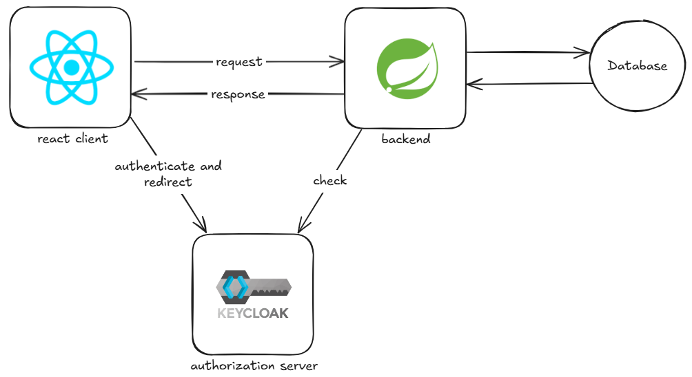
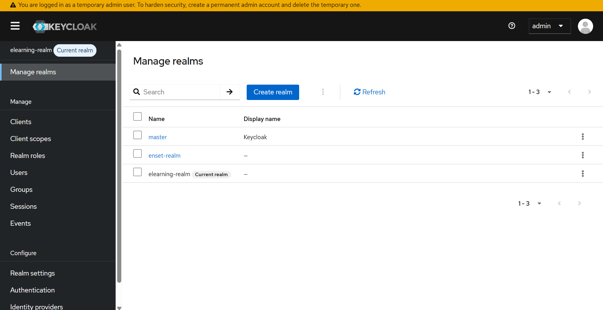
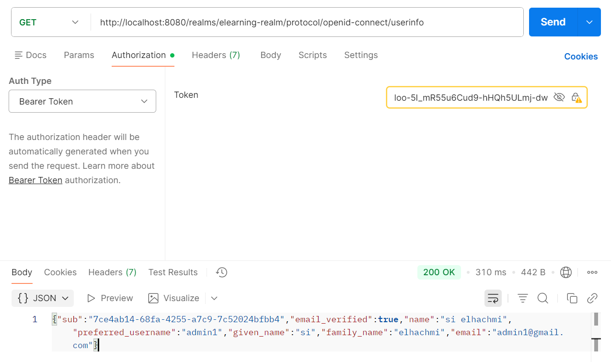
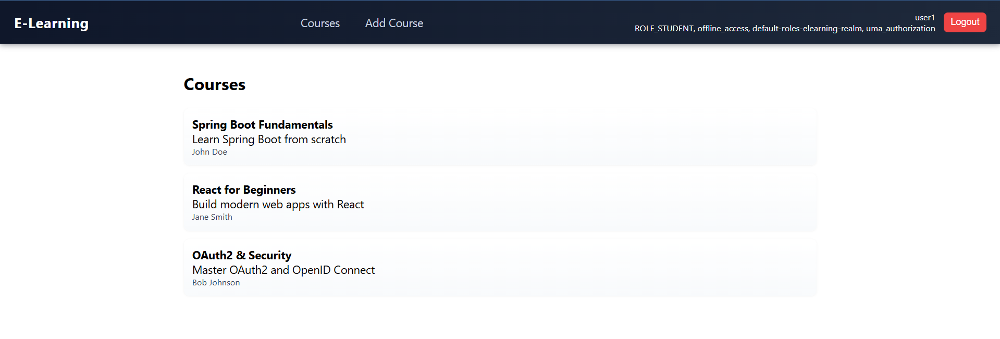
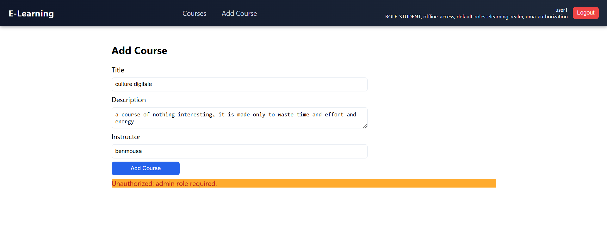

# Practical work of spring boot, keyclock, react js

## Objectives 

- in this practical work we will explore how keyclock works, with spring boot as a resource server and react js as a client.

## Practical work

### Keyclock configuration (Part 1)

- first we will open keyclock with the docker and do the following steps:
  - create a new realm
  - create two roles in the realm (student and admin)
  - create new users and assign the roles to them
  - create a new client which is the React client

- here are the users created


- Next step is to create a spring boot project with the following dependencies
```xml
<dependency>
    <groupId>org.springframework.boot</groupId>
    <artifactId>spring-boot-starter-security</artifactId>
</dependency>
<dependency>
    <groupId>org.springframework.boot</groupId>
    <artifactId>spring-boot-starter-security-oauth2-resource-server</artifactId>
</dependency>
<dependency>
    <groupId>org.springframework.security</groupId>
    <artifactId>spring-security-oauth2-jose</artifactId>
</dependency>
```
- Next we add the property of the resource server
```properties
spring.security.oauth2.resourceserver.jwt.issuer-uri=http://localhost:8080/realms/enset-realm
```

## Screenshots

### Project architecture



### Keycloak login success



### User info endpoint



### Endpoint of getting courses



### Unauthorized for normal student to add courses



### Authorized for admin to add students


